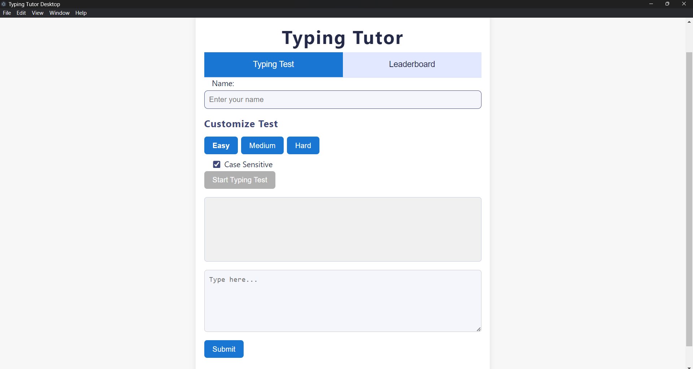
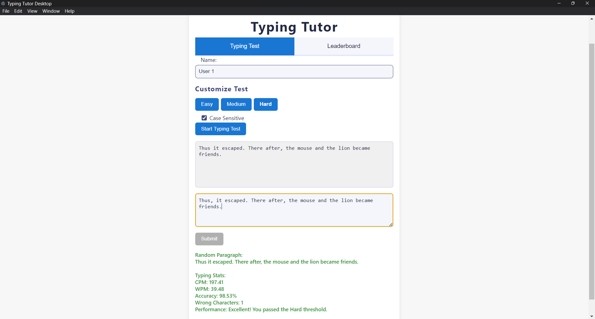
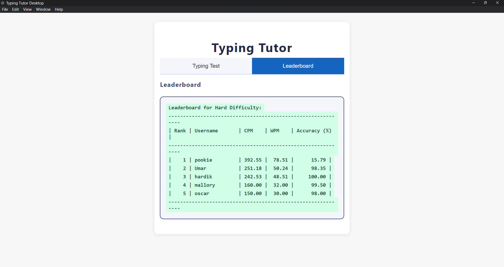

# 🧠 Typing Tutor Desktop ⌨️

> _Boost your typing speed and accuracy — one paragraph at a time!_

Typing Tutor Desktop is a **modern desktop application** (Electron + C backend) designed to help users improve their **typing speed**, **accuracy**, and **confidence**. It features a beautiful UI, customizable difficulty, real-time performance feedback, and a dynamic leaderboard.

---

## ✨ Features

- 📄 **Random Paragraph Selection**
  - Each typing session presents a new, randomly chosen paragraph from a categorized text file.

- ⚡ **Typing Speed & Accuracy Analysis**
  - Measures your typing speed in **Characters Per Minute (CPM)** and calculates **accuracy** as a percentage.

- 🎯 **Difficulty Levels**
  - Choose from **Easy**, **Medium**, or **Hard**. Each level has its own set of paragraphs and stricter speed thresholds.

- 🖥️ **Modern Desktop UI**
  - Built with Electron and styled for a clean, responsive, and attractive look.

- 📝 **Case Sensitivity Option**
  - Toggle case sensitivity for a more challenging typing test.

- 📊 **Dynamic Leaderboard**
  - Displays the top 5 scores for each difficulty level.
  - Highlights the current user if they are on the leaderboard.
  - Ensures each user has only one entry per difficulty, updating their score if they achieve a better result.

- 🧑‍💻 **Custom Username**
  - Users can enter their name before starting the test, which will be displayed on the leaderboard.

---

## 🚀 Getting Started

### ✅ Prerequisites

- **Node.js** and **npm** (for Electron):  Download and install from [https://nodejs.org/](https://nodejs.org/).
- **A C compiler** (e.g., `gcc`):  Ensure a C compiler is installed on your system.  For Windows, consider using MinGW.  For macOS, use Xcode's command-line tools.  For Linux, use your distribution's package manager (e.g., `apt-get install build-essential` on Debian/Ubuntu).
- **`paragraphs.txt`:** A text file named `paragraphs.txt` is required in the `build/` folder. This file contains the paragraphs for typing practice, categorized by difficulty level. The format is as follows:

```
#Easy
This is an easy paragraph.  It should be short and simple.

Another easy paragraph for practice.

#Medium
This is a medium-difficulty paragraph. It's a bit longer and may include more complex words.

Another medium paragraph.  More words!

#Hard
This is a hard paragraph. It contains challenging words and longer sentences.

Another hard paragraph to test your typing skills!
```
---

## ⚙️ Project Structure

```
Typing-Tutor/
├── app/                    # Electron frontend
│   ├── main.js             # App entry point
│   ├── index.html          # UI layout
│   ├── ...                 # Supporting assets and scripts
│
├── build/                  # Backend artifacts and data
│   ├── typingtutor.exe     # Compiled C executable
│   ├── paragraphs.txt      # Categorized text for practice
│   ├── leaderboard.txt     # Stores leaderboard results
│
├── typingtutor.c           # C backend source code
├── README.md               # Project documentation
└── .github/workflows/
    └── release.yml         # GitHub Actions workflow (Windows build)
```
---

## 📁 Files

- `app/` – Electron frontend (HTML, CSS, JS)
- `build/typingtutor.exe` – Compiled C backend
- `build/paragraphs.txt` – Paragraphs for practice (categorized)
- `build/leaderboard.txt` – Dynamic leaderboard file
- `typingtutor.c` – Main C source code
- `.github/workflows/release.yml`: GitHub Actions workflow for building and releasing the C executable.
- `LICENSE`: MIT License information.

---

# 🚀 Getting Started
---


## 🛠️Setup Instructions

Follow these steps carefully to build and run the application locally:

### 1. Clone the Repository

```bash
git clone https://github.com/itsmenuma/Typing-Tutor.git
cd Typing-Tutor
```

If you’re working on your fork, use:

```bash
git clone https://github.com/<your-username>/Typing-Tutor.git
cd Typing-Tutor
```

---

### 2. Prepare the `build/` Directory

Ensure the `build/` folder exists. If not create it:

```bash
mkdir -p build
```

Then compile the C backend (Windows example using `gcc`):

```bash
gcc typingtutor.c -o build/typingtutor.exe
```
This will create the `typingtutor.exe` file needed by the Electron app.  (Adjust for other OSes).

---

### 3. Add Paragraph Data

Edit or create a `paragraphs.txt` file inside the `build/` directory if it doesn't exist with your own categorized paragraphs (see the example above in Prerequisites). 

---

### 4. Install Dependencies (Frontend)

Navigate to the frontend directory:

```bash
cd app
npm install
```

---

### 5. Run the Application

While inside the `app/` directory:

```bash
npm start
```

The Electron app will launch and communicate with the compiled backend binary located at `../build/typingtutor.exe`.

---

### 6. Using the App

- **Enter Your Name** - Enter your name in the input field before starting the test.
- **Choose Difficulty & Options** - Select Easy, Medium, or Hard and toggle case sensitivity.
- **Start Typing** - Click "Start Typing Test" to get a random paragraph. Type it as fast and accurately as possible.
- **Get Your Stats** - See your CPM, WPM, accuracy, and performance feedback instantly.
- **View the Leaderboard** - Click "Leaderboard" to see the top 5 scores for the selected difficulty. Your name will be highlighted if you are on the leaderboard.

---

## 🖼️ Screenshots

### 🏠 Home Screen


### 🧪 Typing Test in Progress


### 🏆 Leaderboard View


---

## 🤝 Contributing

We ❤️ contributions and welcome your help! Here's how you can contribute:

1. **Fork the Repository**  
    - Create your own copy of the project.

2. **Create a Feature Branch**  
   ```bash
   git checkout -b feature/your-feature-name
   ```

3. **Make Your Changes**  
   - Follow existing code style conventions (clean, readable, well-commented code).  
   - Test your changes locally using `npm start` and building the C backend if needed.

4. **Commit Your Changes**  
   Use clear, concise commit messages:  
   ```bash
   git commit -m Your commit message"  
   ```

5. **Push Your Branch**  
   ```bash
   git push origin feature/your-feature-name
   ```

6. **Open a Pull Request**  
    - Submit your changes for review on GitHub.

---

If you have bug reports or a feature suggestion, please [open an issue](https://github.com/itsmenuma/Typing-Tutor/issues) with detailed information.

---

## 📜 License

Licensed under the [MIT License](LICENSE)

---

## 🙌 Acknowledgments

Inspired by traditional typing tutor tools and modern desktop app design.

---

## 📬 Contact

Got a question or feedback? Reach out at: **[numarahamath@gmail.com](mailto:numarahamath@gmail.com)**

---

## 🛠️  Troubleshooting

* **Compilation Errors (C Backend):** Ensure you have a compatible C compiler installed and correctly configured in your system's PATH environment variable.  Refer to the compiler's documentation for installation and setup instructions.  The error messages from the compiler will provide details about the specific issues encountered.

* **`paragraphs.txt` Errors:** Check that `paragraphs.txt` is in the correct location (`build/`) and is formatted correctly (see Prerequisites section).  The application will output an error if it cannot load paragraphs from this file.

* **Leaderboard Issues:** The leaderboard data is stored in `build/leaderboard.txt`.  If there are issues with leaderboard display, check if this file is being correctly written to and read from by the application.


* **Electron App Errors:** If the Electron application fails to start, check the console for detailed error messages.  These messages might indicate problems with Node.js installation, dependency resolution, or configuration files.  Consider reviewing the `app/package.json` file for any potential issues.  A common problem can be an incorrect path to the `typingtutor.exe` file in `app/main.js`.
